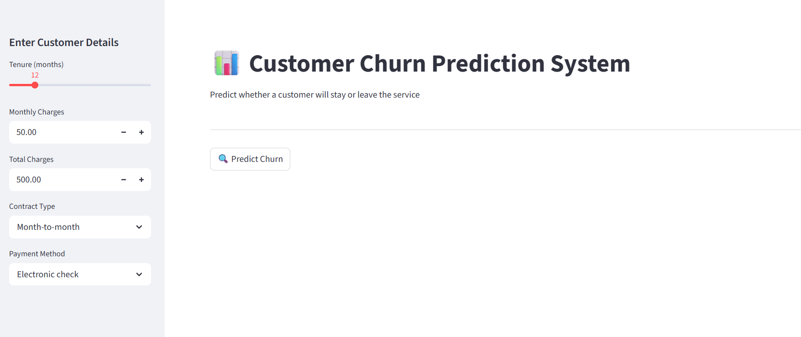
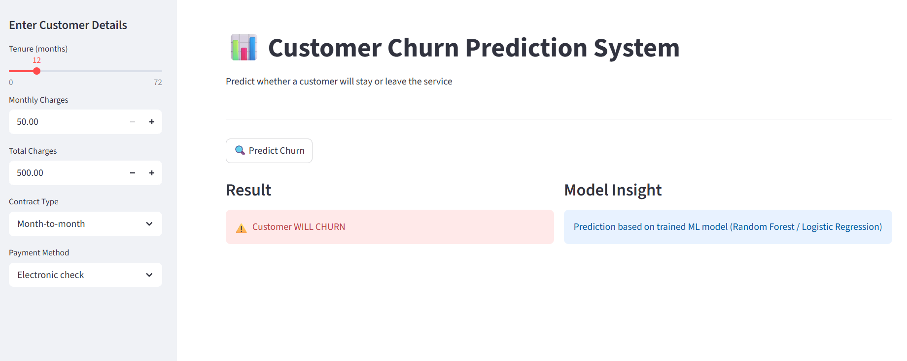

# 📊 Customer Churn Prediction System

An end-to-end Machine Learning project that predicts whether a telecom customer will **stay or leave (churn)** based on their usage behavior and service details.  
The project includes data preprocessing, model training, evaluation, and a deployed interactive web app using Streamlit.

---

## 🚀 Live Demo
👉 https://customer-churn-prediction-cwk8bds4nm9rxyjttp8asg.streamlit.app/

---

## 📌 Problem Statement
Customer churn is a major problem for subscription-based companies.  
The goal of this project is to **predict whether a customer will churn** so that companies can take preventive actions like:
- Personalized offers
- Customer retention strategies
- Targeted marketing campaigns

---

## 📊 Dataset
- Source: Public Telecom Customer Dataset (Kaggle-like structure)
- Features include:
  - Tenure
  - Monthly Charges
  - Total Charges
  - Contract Type
  - Payment Method
  - Internet Services (encoded)

---

## 🧠 Machine Learning Workflow

Data → Cleaning → Encoding → Training → Evaluation → Deployment

---

## ⚙️ Tech Stack

- Python 🐍
- Pandas & NumPy
- Scikit-learn
- Matplotlib & Seaborn
- Streamlit (for web app)
- Git & GitHub

---

## 🤖 Machine Learning Models Used

- Logistic Regression
- Decision Tree
- Random Forest (Best Model Selected)

---

## 🏆 Best Model Performance

- Accuracy: ~81%
- Evaluation Metrics:
  - Confusion Matrix
  - Precision / Recall
  - ROC Curve

---

## 📊 Features

- Interactive Streamlit UI
- Real-time prediction
- Sidebar input system
- Encoded categorical handling
- Clean dashboard layout
- Live deployment

---


## 🖥️ How to Run Locally

### 1️⃣ Clone Repository
```bash
https://customer-churn-prediction-cwk8bds4nm9rxyjttp8asg.streamlit.app/
```

### 2️⃣ Install Dependencies
```bash
pip install -r requirements.txt
```

### 3️⃣ Run Streamlit App
```bash
streamlit run app.py
```

---

## 📁 Project Structure

Customer-Churn-Prediction/
│
├── app.py
├── main.py
├── models/
│   ├── churn_model.pkl
│   └── columns.json
├── data/
├── images/
├── outputs/
├── requirements.txt
└── README.md

---
## 📸 Screenshots

### 🏠 Home UI


### 📊 Prediction Result


---

## 💡 Business Impact
- Helps companies reduce customer loss
- Improves retention strategies
- Supports data-driven decision making
- Saves revenue by identifying risky customers

---

## 🔥 Future Improvements
- Add deep learning models
- Improve feature engineering
- Deploy with Docker
- Add user authentication
- Add dashboard analytics

---

## 👨‍💻 Author

Nidhi Apotikar

---
⭐ If you like this project

Give it a ⭐ on GitHub and connect on LinkedIn!

